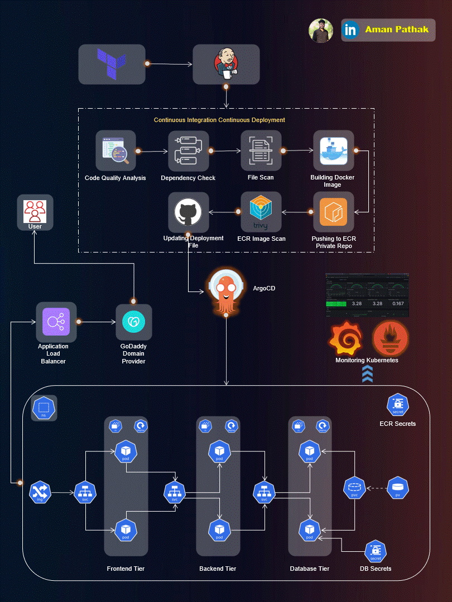

# Three-Tier MERN App: DevSecOps on AWS EKS

A complete end-to-end pipeline to build, scan, and deploy a production-ready MERN (MongoDB, Express, React, Node.js) application on AWS EKS using Jenkins, ArgoCD, and Kubernetes with integrated security and monitoring.

---

## 🏗️ Project Overview

- **Infrastructure**: [EKS-Terraform-setup](https://github.com/Gaurav10111/EKS-Terraform-setup.git) for cluster, VPC, and networking (step 1/2).
- **Application**: MERN (React frontend, Node/Express backend, MongoDB database), with Dockerfiles for each.
- **Kubernetes Deployments**: YAML manifest files for all app tiers, including persistent storage and secure secrets.
- **Ingress**: AWS Application Load Balancer (ALB) via AWS Load Balancer Controller.
- **Deployment Method**: Automated via ArgoCD GitOps after CI image tagging.
- **Monitoring**: Prometheus and Grafana.
- **Security**: Integrated with SonarQube, OWASP Dependency Check, Trivy.

---

## 🗂️ Repository Structure

├── Application-Code/  
│ ├── frontend/ # React code + Dockerfile  
│ └── backend/ # Node/Express code + Dockerfile  
├── Kubernetes-Manifests-file/  
│ ├── Frontend/  
│ │ ├── deployment.yaml  
│ │ └── service.yaml  
│ ├── Backend/  
│ │ ├── deployment.yaml  
│ │ └── service.yaml  
│ ├── Database/  
│ │ ├── deployment.yaml  
│ │ ├── service.yaml  
│ │ ├── pv.yaml  
│ │ ├── pvc.yaml  
│ │ └── secrets.yaml  
│ └── Ingress/  
│ └── ingress.yaml  
├── Jenkins-Pipeline-Code/  
│ ├── Jenkinsfile-Frontend  
│ └── Jenkinsfile-Backend  

---

## 🚦 End-to-End Flow

### 1️⃣ Infrastructure Provisioning
Provision your EKS cluster and networking in AWS using [EKS-Terraform-setup](https://github.com/Gaurav10111/EKS-Terraform-setup.git) with Jenkins automation.

### 2️⃣ Build & Secure with Jenkins
For both frontend and backend:
- Clean workspace, checkout code.
- **SonarQube**: Static code analysis.
- **OWASP Dependency Check**: Scan for library vulnerabilities.
- **Trivy**: Scan files/directories for vulnerabilities.
- Build Docker image for app.
- Push image to AWS ECR.
- **Trivy (Image Scan)**: Scan built image.
- Update app deployment manifest with new image tag and push to GitHub.

### 3️⃣ GitOps Delivery through ArgoCD
- ArgoCD watches repository for manifest changes.
- Automatically deploys updated backend, frontend, and DB on EKS cluster.
- Ingress resource provisions public ALB via AWS Load Balancer Controller.

### 4️⃣ Robust, Real-Time Monitoring
- **Prometheus**: Metrics scraping/collection.
- **Grafana**: Visualization dashboards linked to your EKS and workloads.

### 5️⃣ Secure Database
- MongoDB runs as a managed Kubernetes Deployment with PersistentVolumeClaim.
- Secrets stored in K8s secret objects.

---

## 📝 Key Kubernetes Manifests

- **Ingress**: `ingress.yaml` defines ALB rules/routes `/api` → backend, `/` → frontend, health/ready probes.
- **Frontend/Backend/DB Deployments**: Each with dedicated Docker image, ECR registry, rolling updates, and health checks.
- **Secrets & Volumes**: Secure, persistent DB storage and access credentials via Kubernetes secrets.

---

## 🔍 Monitoring & Security Tools

- **SonarQube**: Quality gate for every PR/build.
- **OWASP Dependency-Check**: Finds vulnerable packages.
- **Trivy**: Scans files and containers for vulnerabilities.
- **Prometheus**: In-cluster monitoring.
- **Grafana**: Dashboards for real-time insights.

---

## 📊 See The Pipeline In Action

Check my LinkedIn post for a full visual walkthrough,
including Jenkins, ArgoCD, SonarQube, Prometheus, and Grafana in action:
- [👉 View LinkedIn Post (https://www.linkedin.com/posts/gauravpatil20_aws-eks-devsecops-activity-7363199518063972354-SLtu?utm_source=share&utm_medium=member_desktop&rcm=ACoAAEDC-98BDnksxUIcgMuM03zRe0M_L1Xka-Q)]

---

## 💡 Quick Start

1. __Provision EKS__:  
   See [EKS-Terraform-setup](https://github.com/Gaurav10111/EKS-Terraform-setup.git) to provision cluster and networking.

2. __Connect Jenkins to AWS & GitHub__:  
   Ensure all needed credentials are set up (see environment blocks in Jenkinsfile).

3. __Create ECR repos__:  
   Make sure AWS ECR repos for frontend and backend exist.

4. __Setup SonarQube, Prometheus, and Grafana__:  
   Deploy them to EKS as per scripts/guides.

5. __Create ArgoCD apps__:  
   To sync Kubernetes manifest folders for frontend, backend, database, and ingress.

6. __Run Jenkins Pipelines__:  
   Pipelines build, scan, push images, and update manifests, triggering ArgoCD auto-deployment.

---

## 🙏 Acknowledgements & Credits

- **Architecture diagram and methodology by [AmanPathak-DevOps](https://github.com/AmanPathak-DevOps)**
- Special thanks to [iam-veeramalla](https://github.com/iam-veeramalla) and Aman for their amazing explanations and guidance throughout the project development.

---
